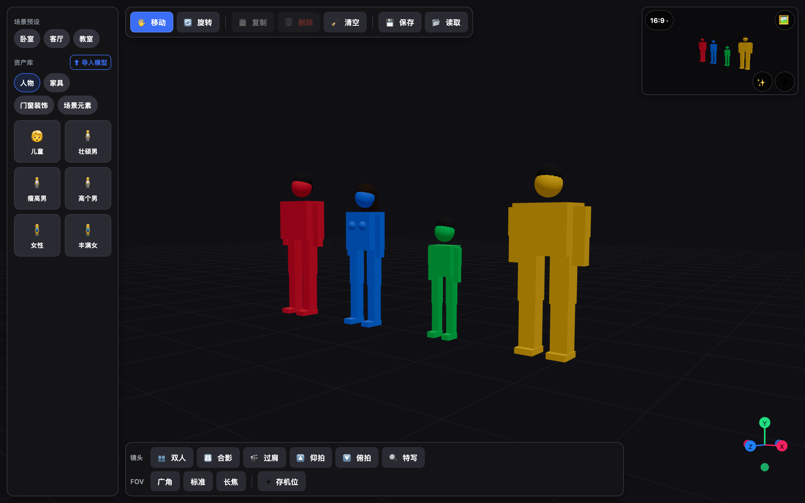
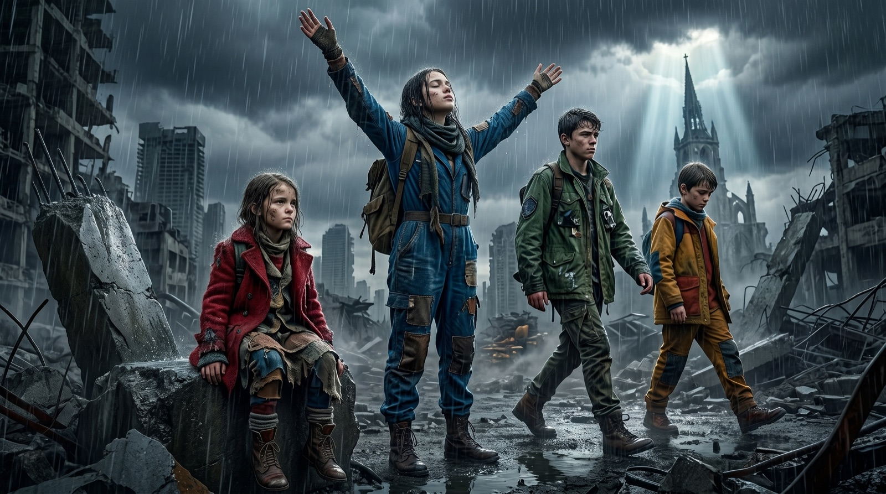
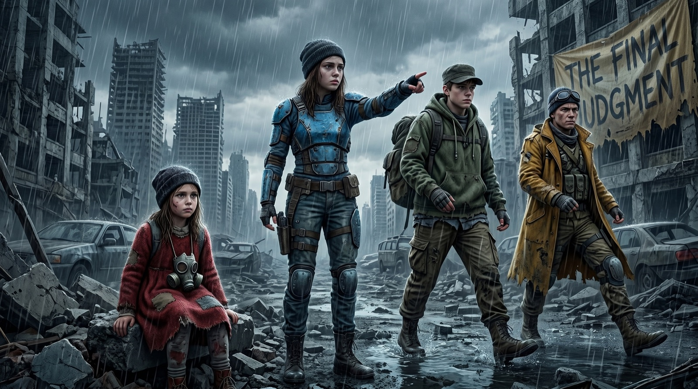

# AI Scene Composer

English | [简体中文](./README.zh-CN.md)

[](https://github.com/hendrywang/AISceneComposer/actions/workflows/ci.yml)
[](./LICENSE)
[](./.nvmrc)

AI Scene Composer is a lightweight 3D blocking tool for AI image generation.

It solves a practical problem: when you generate images with text prompts alone, character positions, camera angle,
body poses, and small structural details in the scene are often hard to control. This project lets you first build a
simple 3D reference image, then send that reference to an image model so the final render keeps the spatial layout you
actually intended.

The core workflow is simple:

1. Place colored proxy characters, props, and rooms in a lightweight 3D editor.
2. Set the camera and composition like a storyboard or virtual set.
3. Export a clean blocking image.
4. Use that image as the visual reference for Google Gemini / Nano Banana-style image generation.

> Status: alpha. The web editor, local scene save/load, model import, and resource library workflow are usable. Cloud
> persistence and production-grade generation are still in progress.



## Why This Exists

Text-to-image models are powerful, but text is a weak control surface for geometry.

Prompts like "the child sits on the left, the tall woman stands in the middle with arms raised, two people walk on the
right, wide cinematic shot" can still produce random spacing, swapped subjects, wrong poses, or an unexpected camera.

AI Scene Composer moves the hard spatial work into a simple 3D layer:

- Character positions are controlled by the layout, not only by words.
- Pose and scale are visible before generation.
- Camera framing is chosen explicitly.
- The generated image can focus on style, lighting, detail, and realism.

## Example

The 3D blocking image is intentionally simple. It is not meant to be beautiful; it is a precise composition guide.

| 3D blocking reference                                                                                    | Generated image                                                                                                              |
| -------------------------------------------------------------------------------------------------------- | ---------------------------------------------------------------------------------------------------------------------------- |
|  |  |

The same idea can be used with a different prompt/style direction:

| 3D blocking reference                                                                                                | Generated image                                                                                                                   |
| -------------------------------------------------------------------------------------------------------------------- | --------------------------------------------------------------------------------------------------------------------------------- |
|  |  |

The important part is not that the proxy figures look realistic. The important part is that the final image preserves
the intended left/right arrangement, relative scale, pose direction, and camera framing much more reliably than a
prompt-only workflow.

## Features

- **3D virtual set editor**: place proxy actors, props, and rooms.
- **Color-coded characters**: use simple identity colors that can be referenced in prompts.
- **Camera system**: save cameras, switch views, adjust FOV, and apply cinematic presets.
- **Clean export**: generate a composition image without UI controls or selection helpers.
- **Local scene files**: save and reload JSON scene snapshots.
- **glTF/GLB import**: import user models at runtime and store them in scene snapshots as self-contained assets.
- **Model splitting**: split imported glTF models by top-level parts for separate selection and movement.
- **File-based resource library**: add assets by adding `models/<id>/meta.json`.
- **Open-source ready workflow**: license, contribution guide, CI, linting, formatting, tests, and asset credits.

## What It Is Not

- It is not a full 3D modeling tool.
- It is not a character rigging or animation system.
- It is not tied to only one image model; the editor exports a reference image that can be used with any model that
  accepts image references.
- It is not production SaaS yet; Firebase persistence, storage, queueing, and billing are planned but not complete.

## Quick Start

Requirements:

- Node.js 20 or newer
- pnpm 9.15.3 through Corepack

```bash
corepack enable
corepack prepare pnpm@9.15.3 --activate
pnpm install
pnpm web
```

Open the Expo web URL printed by the dev server.

## Useful Commands

```bash
pnpm gen                                  # regenerate resource catalog and credits
pnpm web                                  # start the web editor
pnpm api                                  # start the local API skeleton
pnpm build                                # generate catalog and build/typecheck packages
pnpm build:web                            # export the Expo web build
pnpm lint                                 # ESLint
pnpm test                                 # Node test runner via tsx
pnpm typecheck                            # TypeScript checks through Turbo
pnpm format:check                         # Prettier check
pnpm check                                # local equivalent of the main CI checks
pnpm --filter @asc/resource-library check # resource catalog consistency checks
```

## Repository Layout

```text
apps/client                 Expo web editor: 3D scene, camera, import/export UI
packages/resource-library   File-based model catalog and contribution surface
packages/shared-types       Shared TypeScript contracts for scene/generation data
services/api                Cloud Run-style Node/TypeScript API skeleton for Gemini
docs/                       Architecture notes, Firebase plan, asset pipeline, roadmap
```

## Resource Library

The resource library is designed for community contribution:

```text
packages/resource-library/models/<asset-id>/meta.json
packages/resource-library/models/<asset-id>/model.glb
```

One model equals one folder. Run `pnpm gen` after changing model metadata. The generated catalog and license credits
must stay committed.

See [packages/resource-library/README.md](./packages/resource-library/README.md) and
[CONTRIBUTING.md](./CONTRIBUTING.md) for details.

## Architecture

```text
3D editor (Expo web + React Three Fiber)
        |
        | clean blocking reference image
        v
API service (Node / TypeScript, Cloud Run style)
        |
        | image + prompt
        v
Image generation model
```

The editor is intentionally thin and local-first. The server owns model API calls and credentials. The long-term plan is
to add Firebase Auth, Firestore scene persistence, Cloud Storage for generated assets, and optional queueing for
generation jobs.

## Current Limitations

- The generation API is still a skeleton and currently not a complete production pipeline.
- Scene JSON files can become large when they embed imported user models.
- Imported user assets are local scene assets; do not submit them to the repository unless redistribution rights are
  clear.
- Native iOS/Android packaging is not the current target. Web and iPad Safari come first.

## Roadmap

- Finish the end-to-end generation flow.
- Persist scenes and generated images through Firebase.
- Add stronger schema validation for scene files and imported assets.
- Expand the CC0/redistributable resource library.
- Add richer prompt templates for realistic and anime styles.
- Improve visual QA and regression testing for exported blocking images.

## Contributing

The easiest way to contribute is to add clean, redistributable assets to the resource library.

Please read [CONTRIBUTING.md](./CONTRIBUTING.md) before opening a pull request. Asset licensing is taken seriously:
prefer CC0 assets, include attribution where required, and never submit assets with unclear redistribution rights.

## Licensing

Code is licensed under the Apache License 2.0. See [LICENSE](./LICENSE) and [NOTICE](./NOTICE).

3D assets may have their own licenses. Asset-specific metadata lives in
`packages/resource-library/models/*/meta.json`, and generated credits live in
[packages/resource-library/CREDITS.md](./packages/resource-library/CREDITS.md).

Do not assume a model asset is covered by the repository code license.

## Security

Please report suspected vulnerabilities privately. See [SECURITY.md](./SECURITY.md).

## Documentation

- [Project structure](./docs/project-structure.md)
- [Development plan](./docs/development-plan.md)
- [Phase 1 tasks](./docs/phase-1-tasks.md)
- [Asset library](./docs/asset-library.md)
- [Firebase architecture](./docs/firebase-architecture.md)
- [Deployment](./docs/deployment.md)
- [Open-source release guide](./docs/open-source-release.md)
